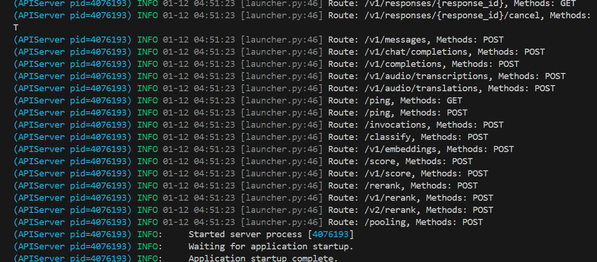
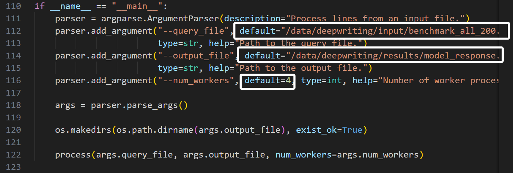
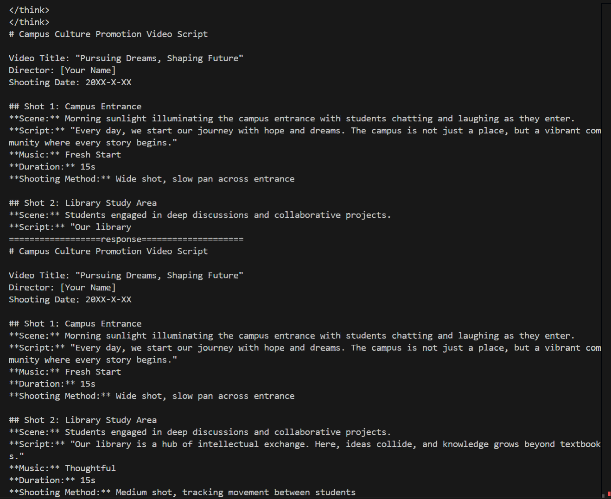
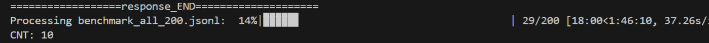
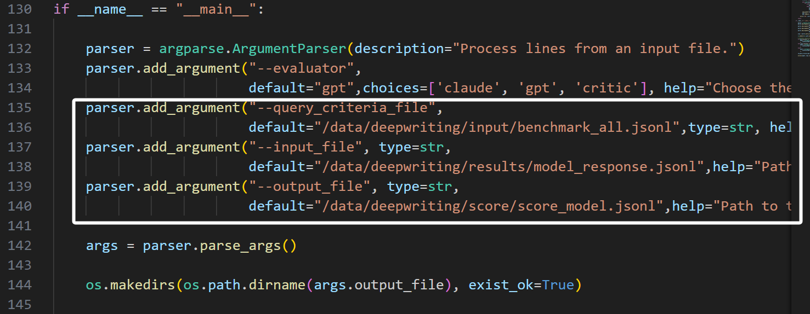
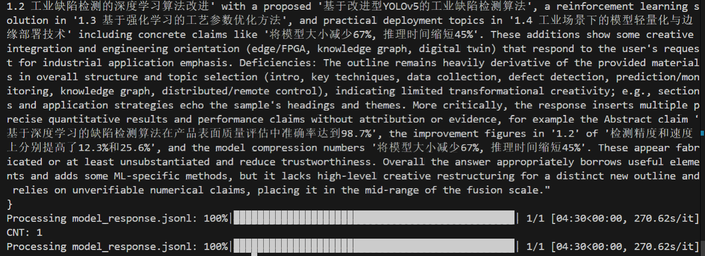
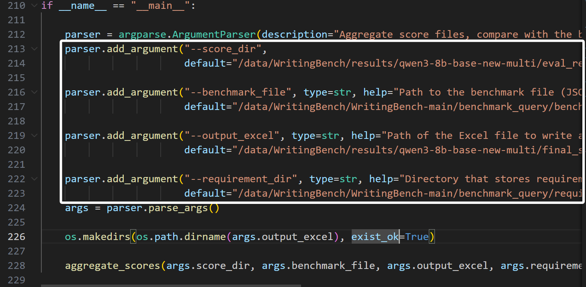
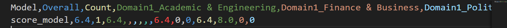

# WritingBench评估步骤
## 1.配置环境：
> conda create -n wb python=3.11  
> pip install -r requirements.txt 

## 2.下载模型
请先建立一个文件夹，命名为:"`model`" 
接下来需要从huggingface中下载对应模型到`model`文件夹内 
最终模型存储路径应该为`model/huggingface/...` 
`huggingface`文件夹内放置所有模型相关文件。 

## 3.启动vLLM

vLLM用于提升模型推理效率。部署前需依据使用者本地设备情况调整核心参数，随后启动服务。 

### 需修改的vLLM参数
需修改的文件为：<b>`qwen3_8b_start.sh`</b>
需要修改的参数为：
- CUDA_VISIBLE_DEVICES：设定当前进程可见的 GPU 设备。例：设置CUDA_VISIBLE_DEVICES=4,5,6,7，即同时使用编号为4,5,6,7的四块GPU。 
- tensor-parallel-size：具体使用了多少块GPU。如上例所示，使用了四块GPU，则tensor-parallel-size = 4 
- 将`qwen3_8b_start.sh`中的`/data/deepwriting/model/huggingface`修改为用户本地的模型存放路径 

### 命令行启动
> conda activate wb 
> cd deepwriting  
> bash qwen3_8b_start.sh

启动成功显示如下： 
 

## 4.采样

### 参数修改
需修改的文件为：<b>`generate_response.py`</b> 
需要修改的参数为：
- --query_file ：用于模型采样的input_query文件路径。
- --output_file ： 模型输出文件的存储路径。
- --num_workers ：GPU的使用数量。 

`query_file与output_file修改为本地路径，num_workers根据CUDA_VISIBLE_DEVICES设置修改。` 
`例:CUDA_VISIBLE_DEVICES=4,5,6,7,即使用了4块GPU，此处num_workers = 4.` 

文件内对应位置为： 
 

### 命令行启动
修改完毕，启动运行。
> python generate_response.py

运行成功时，会有如下显示： 
 

<b>注</b>： 
运行完毕时，命令行打印的进度条可能不会显示为100%，但实际上对所有输入query都进行了处理，输出文件也是完整，当发现此问题时可以直接忽略。 
出错的显示如下： 
 

## 5.LLM打分
### 参数修改
需修改的文件为：<b>`evaluate_benchmark.py`</b> 
需要修改的参数为：
- --query_criteria_file : benchmark的输入query文件路径。
- --input_file : 模型回复文件的路径。
- --output_file : LLM打分输出文件路径。

文件内对应位置为： 
 

### 命令行启动
> python evaluate_benchmark.py

运行成功时，会有如下显示： 
 

<b>注</b>： 
当进行LLM评分时，可以关闭前面启动的vLLM，不会影响后续步骤。

### 6.执行文件calculate_scores.py得到结果
### 参数修改
需修改的文件为：<b>`calculate_scores.py`</b> 
需要修改的参数为：
- --score_dir : LLM打分结果文件。
- --benchmark_file : benchmark的输入query文件路径。
- --output_excel : 输出结果的excel文件路径。
- --requirement_dir : 即`requirement`文件夹的路径。代码内已写为相对路径，当运行过`cd deepwriting`进行路径修改时，该参数无需再修改。

文件内对应位置为： 
 

### 命令行启动
> python calculate_scores.py

### 最终结果
 
形如： 
 

